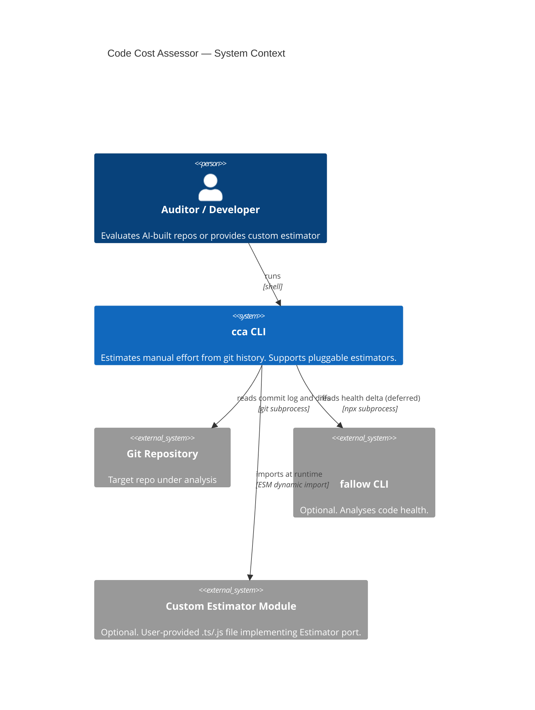
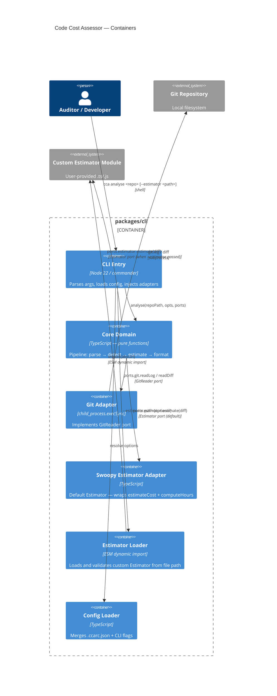

# Feature Delta — estimator-port-adapter

Wave: DISCUSS + DESIGN + DISTILL | Density: lean | Date: 2026-05-22

---

## Wave: DISCUSS / [REF] Persona ID

**Primary**: `developer` — builds on top of the tool, or extends it for a specific
context. Writes a custom estimator module and wires it in via Ports injection or
a CLI flag. May publish the module for other teams to reuse.

**Secondary**: `auditor` (J-01) — the end beneficiary. A more defensible estimate
is only possible if the developer has successfully plugged in a calibrated model.

---

## Wave: DISCUSS / [REF] JTBD One-Liner

**J-03 (primary)**: When the Swoopy defaults don't reflect my team's actual
throughput, I want to plug in a custom estimator module at runtime, so I can
produce calibrated estimates without forking the tool.

**J-01 (secondary, inherited)**: The auditor still needs a defensible, methodology-
backed number — now that number can come from a calibrated custom model rather
than generic Swoopy rates.

---

## Wave: DISCUSS / [REF] Locked Decisions

### D-06: The Estimator port boundary sits at the diff → EffortEstimate level
**Verdict**: The `Estimator` port is a single function: `estimate(diff: string) => EffortEstimate`.
The port owner controls the full estimation pipeline — diff parsing, per-file
classification, cost calculation, and methodology note.
**Rationale**: Splitting the boundary at `FileStats[]` (parse vs. compute) leaks
a Swoopy-specific intermediate type into the port contract. An alternative model
(e.g., LOC-based, flat-rate) may not produce per-file token counts at all.
The `EffortEstimate.note` field must be populated honestly by every adapter —
this is the port's honesty constraint.
**Open question deferred to DESIGN**: whether `FileStats[]` should remain
derivable from the estimate output (e.g., as an optional field on `EffortEstimate`)
for display in JSON format. DESIGN to resolve.
**Impact on types**: `EffortEstimate` may gain an optional `fileStats?` field.
`Ports` gains an `estimator: Estimator` field. `analyse.ts` stops importing
`estimateCost` and `computeHours` directly.

### D-07: Default adapter wraps the current Swoopy implementation
**Verdict**: The existing `estimateCost` + `computeHours` pair becomes the
`swoopyEstimator` adapter. All existing behaviour is preserved behind the port.
`index.ts` passes `swoopyEstimator` as the default when no custom estimator is
provided. No user-visible output change for slice 1.
**Rationale**: Zero regression by construction — the default path is identical
to the current path, just mediated by the port interface.

### D-08: CLI --estimator flag accepts a file path, dynamically imported
**Verdict**: `cca analyse <repo-path> --estimator <path>` dynamically imports
the file at `path` and expects it to export a default conforming to the
`Estimator` port type. Validation error if the export is missing or malformed.
**Rationale**: Runtime plugin loading is the only approach that doesn't require
rebuilding the binary. Node ESM dynamic import handles both `.ts` (if
strip-types is active) and `.js` modules.
**Risk**: dynamic import of arbitrary user code is by design — this is an
explicit developer affordance, not a security gap. Documented in README.

---

## Wave: DISCUSS / [REF] User Stories

### Story 1 — Inject a custom estimator via Ports

**As a** developer building on top of `cca`,
**I want** an `Estimator` port type I can implement and pass to `analyse()`,
**so that** I can produce estimates with my team's calibrated throughput rates
without modifying the tool's source code.

`job_id: J-03`

#### Elevator Pitch
Before: `analyse()` has `estimateCost` hardcoded — there is no way to inject
an alternative model without patching the source.
After: `import { analyse } from 'cca'; analyse('.', {}, { git: gitAdapter, estimator: myEstimator })` → returns `AnalysisResult` where every `session.effortEstimate` was computed by `myEstimator.estimate(diff)`.
Decision enabled: developer confirms the port type fits their custom model
and the contract is stable before investing in slice 2.

#### Acceptance Criteria

- AC-1.1: `Estimator` type is exported from `ports.ts` as `{ estimate: (diff: string) => EffortEstimate }`.
- AC-1.2: `Ports` type has an `estimator: Estimator` field.
- AC-1.3: `analyse()` calls `ports.estimator.estimate(diff)` for each commit diff instead of importing `estimateCost` directly.
- AC-1.4: `index.ts` passes `swoopyEstimator` as the default — running `cca analyse <repo>` with no `--estimator` flag produces byte-identical output to the current implementation.
- AC-1.5: A unit test verifies that a stub estimator (returns a fixed `EffortEstimate`) is called once per commit and its output appears in the session totals.

---

### Story 2 — Load a custom estimator module from a file path via CLI

**As a** developer or advanced CLI user,
**I want** to pass `--estimator <path>` to `cca analyse`,
**so that** I can use a custom estimator module at runtime without writing
wrapper code or modifying `index.ts`.

`job_id: J-03`

#### Elevator Pitch
Before: `cca analyse .` always uses the Swoopy model — no shell-level override exists.
After: `cca analyse . --estimator ./my-model.js` → stdout session table where `effortEstimate.note` shows the custom methodology string from `my-model.js`.
Decision enabled: auditor can confirm the custom estimate is defensible before
presenting it — the methodology note in the output is the evidence.

#### Acceptance Criteria

- AC-2.1: `cca analyse <repo> --estimator <path>` dynamically imports the module at `<path>`.
- AC-2.2: The module's default export must satisfy `{ estimate: (diff: string) => EffortEstimate }`. If missing or malformed, the CLI exits 1 with a descriptive error message.
- AC-2.3: When a valid custom estimator is loaded, the output's `note` field (summary and JSON) reflects the value returned by the custom module, not the Swoopy default string.
- AC-2.4: When `--estimator` is not passed, behaviour is identical to pre-feature (Swoopy default).
- AC-2.5: An integration test loads a fixture estimator file and asserts the custom `note` appears in the formatted output.
- AC-2.6: If the loaded estimator's `estimate()` throws at runtime, `cca analyse` exits 1 with the error message on stderr — it does not silently fall back to Swoopy. The `note` field in `EffortEstimate` is optional (may be an empty string); the tool does not validate it beyond type safety.

---

## Wave: DISCUSS / [REF] Definition of Done

- [ ] All ACs for both stories have passing tests (unit + integration)
- [ ] `Estimator` type exported from `ports.ts`; `Ports` updated
- [ ] `analyse.ts` no longer imports `estimateCost` or `computeHours` directly
- [ ] `swoopyEstimator` adapter created; existing behaviour unchanged (byte-identical output)
- [ ] `--estimator` flag wired in `index.ts`; dynamic import with validation
- [ ] `cca analyse <repo>` (no flag) output is byte-identical to pre-feature output
- [ ] README documents the `Estimator` port type and `--estimator` flag with example
- [ ] No new lint or type errors introduced
- [ ] Dependency-cruiser rules pass (no new cross-boundary imports)

---

## Wave: DISCUSS / [REF] Out of Scope

- Named built-in estimator variants (e.g. `--estimator conservative`) — not in scope; the port enables this later
- Config-file-based estimator selection (`.ccarc` key) — deferred; CLI flag first
- Custom `FileStats[]` output from custom estimators — deferred to DESIGN
- Validation of estimator output values (negative hours, NaN) — deferred; trust the port contract for now
- Publishing or discovering community estimator modules — out of scope

---

## Wave: DISCUSS / [REF] WS Strategy

**Strategy B — Real but minimal.**

Slice 1 is the walking skeleton: port defined, default adapter in place, `analyse.ts`
wired. No user-visible change. Proves the port boundary is load-bearing and the
default path regresses nothing.

Slice 2 adds the CLI surface. Proves the runtime plugin loading works end-to-end
with a real file and real output.

---

## Wave: DISCUSS / [REF] Driving Ports

- **Programmatic API**: `analyse(repoPath, opts, ports)` — `ports.estimator` is the injection point
- **CLI**: `cca analyse <repo-path> [--estimator <path>]` — shell entry point for slice 2

---

## Wave: DISCUSS / [REF] Pre-requisites

- `ai-dev-cost-health-analyser` feature fully delivered (analyse pipeline complete) ✓
- No external dependencies introduced by this feature
- Node ESM dynamic import available (Node 22, ESM already in use) ✓

---

## Wave: DISCUSS / [REF] Outcome KPIs

| KPI | Target | Measurement |
|-----|--------|-------------|
| Port integration time | A developer can implement and wire a custom estimator in < 30 min given only the port type definition | Spike doc / pair session |
| Zero regression on default path | `cca analyse` output byte-identical before/after | Snapshot test in CI |
| Methodology note propagation | Custom estimator's `note` string appears verbatim in `--format summary` and `--format json` output | Integration test (AC-2.3, AC-2.5) |

---

## Wave: DISCUSS / [REF] Wave Decisions

### Key Decisions

- [D-06] Estimator port boundary: `(diff: string) => EffortEstimate` — avoids leaking Swoopy-specific `FileStats[]` into the contract
- [D-07] Default adapter: existing `estimateCost` + `computeHours` wrapped as `swoopyEstimator` — zero regression by construction
- [D-08] CLI flag: `--estimator <path>` with dynamic ESM import — runtime plugin, explicit developer affordance

### Requirements Summary

- Primary job: developer wants to inject a calibrated estimator without patching source
- Two slices: (1) port + default adapter + analyse wiring; (2) CLI `--estimator` flag
- Feature type: backend / cross-cutting (port definition affects core; adapter lives in shell)

### Constraints Established

- Port must return `EffortEstimate` with an honest `note` field — no silent methodology substitution
- Default path must be byte-identical — no user-visible change until slice 2 ships

### Upstream Changes

None. This feature extends the port model established in `ai-dev-cost-health-analyser`
without contradicting any prior DISCOVER or DISCUSS decisions.

### Scope Assessment: PASS

2 stories | 2 bounded contexts | 3 integration points | ≤1 day effort per slice

---

## Wave: DESIGN / [REF] Design Decisions (DDD)

### DDD-1: Estimator port at `(diff: string) => EffortEstimate` (Option A)
**Verdict**: Adopted — aligns with DISCUSS D-06.
Custom estimator owns the full pipeline (diff parsing + cost calculation). The
port returns `EffortEstimate` directly. The `note` field is the honesty contract:
every adapter must populate it with a description of its methodology.
**Rejected**: Option B (`(FileStats[]) => EffortEstimate`) — hours are baked
into `FileStats` by `estimateCost`, so a cost model at that boundary cannot
re-derive per-file hours without a breaking type change. Option C (two ports) is
YAGNI for the stated use case.

### DDD-2: `Totals` gains a `note: string` field
**Verdict**: `Totals` is extended with `note: string`. `computeTotals` in
`analyse.ts` sets it from `sessions[0].effortEstimate.note` (with empty-string
fallback for zero-session edge case). `formatSummary` reads `result.totals.note`
instead of the hardcoded Swoopy string. This fixes an existing coupling smell
in `format.ts` as a consequence of the port extraction.

### DDD-3: `swoopy-estimator-adapter.ts` lives in `shell/`, calls `core/`
**Verdict**: The default adapter imports `estimateCost` and `computeHours` from
`core/` (allowed — dep-cruiser only forbids `core/ → shell/`). The `estimate()`
function composes them: parse diff → compute hours → return `EffortEstimate`.
`estimate-cost.ts` and `compute-hours.ts` are unchanged; they become internal
implementation details of the default adapter.

### DDD-4: `estimator-loader.ts` in `shell/` handles dynamic import + validation
**Verdict**: A dedicated `estimator-loader.ts` module in `shell/` encapsulates
the dynamic import and shape validation. It is NOT inline in `index.ts` — keeping
`index.ts` thin (imperative shell principle). Loader resolves the user-provided
path to an absolute URL before import (handles relative paths from any CWD).
**Validation**: checks `typeof defaultExport === 'object'` and
`typeof defaultExport.estimate === 'function'`. Exits 1 with a descriptive
error if the export is missing or malformed.
**Note**: Node 22 with `--experimental-strip-types` applies TypeScript stripping
to all loaded modules including dynamic imports — `.ts` estimator files work
without a separate compile step.

---

## Wave: DESIGN / [REF] Component Decomposition

| Component | File | Change | Notes |
|-----------|------|--------|-------|
| `Estimator` type | `core/ports.ts` | EXTEND | Add `Estimator = { estimate: (diff: string) => EffortEstimate }` |
| `Ports` type | `core/ports.ts` | EXTEND | Add `estimator: Estimator` field |
| `Totals` type | `core/types.ts` | EXTEND | Add `note: string` field |
| `analyse.ts` | `core/analyse.ts` | EXTEND | Replace `estimateCost` import with `ports.estimator.estimate(diff)`; set `totals.note` |
| `format.ts` | `core/format.ts` | EXTEND | `formatMethodologySection` accepts `note: string`; reads from `result.totals.note` |
| `swoopy-estimator-adapter.ts` | `shell/swoopy-estimator-adapter.ts` | CREATE | Default `Estimator` adapter — wraps `estimateCost` + `computeHours` |
| `estimator-loader.ts` | `shell/estimator-loader.ts` | CREATE | Dynamic import + shape validation for `--estimator <path>` |
| `index.ts` | `src/index.ts` | EXTEND | Pass `swoopyEstimator` default; add `--estimator` option; call `estimatorLoader` |
| `estimate-cost.ts` | `core/estimate-cost.ts` | UNCHANGED | Becomes internal detail of `swoopyEstimator`; no API changes |
| `compute-hours.ts` | `core/compute-hours.ts` | UNCHANGED | Same |

---

## Wave: DESIGN / [REF] Driving Ports

| Port | Surface | Direction |
|------|---------|-----------|
| CLI entry | `cca analyse <repo> [--estimator <path>]` | Inbound |
| Programmatic API | `analyse(path, opts, { git, estimator })` | Inbound |

---

## Wave: DESIGN / [REF] Driven Ports + Adapters

| Port | Adapter | Location | Notes |
|------|---------|----------|-------|
| `GitReader` | `createGitAdapter()` | `shell/git-adapter.ts` | Unchanged |
| `Estimator` (new) | `swoopyEstimator` | `shell/swoopy-estimator-adapter.ts` | Default |
| `Estimator` (new) | User-provided module | Dynamic import at runtime | Via `--estimator <path>` |

---

## Wave: DESIGN / [REF] Port Contracts (updated)

```typescript
// packages/cli/src/core/ports.ts

type LogOpts = { noMerges: boolean; format?: string }

type GitReader = {
  readLog: (repoPath: string, opts: LogOpts) => string
  readDiff: (repoPath: string, sha: string) => string
}

// NEW
type Estimator = {
  estimate: (diff: string) => EffortEstimate
}

type Ports = {
  git: GitReader
  estimator: Estimator   // NEW
}
```

```typescript
// packages/cli/src/core/types.ts — Totals extension

type Totals = {
  sessions: number
  commits: number
  hours: number
  tokens: number
  confidence: string
  note: string           // NEW — propagated from effortEstimate.note
}
```

---

## Wave: DESIGN / [REF] Technology Choices

No new dependencies. All mechanisms in use:
- **Node 22 ESM dynamic import** — `import(absoluteUrl)` for `--estimator` loader
- **`--experimental-strip-types`** — already active; covers dynamic `.ts` imports
- **TypeScript function types** — port contract (`Estimator`) follows existing `GitReader` pattern

---

## Wave: DESIGN / [REF] Reuse Analysis

| Existing Component | File | Overlap | Decision | Justification |
|---|---|---|---|---|
| `estimateCost` | `core/estimate-cost.ts` | Diff parsing + per-file stats | EXTEND (wrap) | Becomes body of `swoopyEstimator.estimate()` — no internal changes |
| `computeHours` | `core/compute-hours.ts` | FileStats → EffortEstimate | EXTEND (wrap) | Called internally by `swoopyEstimator` — no changes |
| `Ports` | `core/ports.ts` | Port registry | EXTEND | Add one field |
| `analyse.ts` | `core/analyse.ts` | Pipeline orchestrator | EXTEND | Replace one import + propagate note |
| `format.ts` | `core/format.ts` | Methodology note display | EXTEND | Decouple from hardcoded Swoopy string |
| `index.ts` | `src/index.ts` | Adapter injection | EXTEND | Add one flag + default wiring |

---

## Wave: DESIGN / [REF] Open Questions

- None. D-06 (port boundary) and the `FileStats[]` open question from DISCUSS are both
  resolved by Option A selection: `FileStats[]` is not in the port contract and not
  needed in JSON output (current `AnalysisResult` schema doesn't expose it).

---

## Wave: DESIGN / [REF] C4 Diagrams (updated)

### System Context (unchanged)



### C4 Container (updated — Estimator Adapter added)



---

## Wave: DESIGN / [REF] Wave Decisions (DESIGN)

### Key Decisions

- [DDD-1] Port at `(diff: string) => EffortEstimate` — full pipeline owned by adapter; Option B structurally broken (see feature-delta.md)
- [DDD-2] `Totals.note` — propagates methodology note to formatter; decouples `format.ts` from Swoopy constants
- [DDD-3] Default adapter in `shell/` — imports from `core/`; dep-cruiser rules respected
- [DDD-4] `estimator-loader.ts` — dynamic import + validation isolated from `index.ts`

### Architecture Summary

- Pattern: Pure Core / Imperative Shell (unchanged — extending existing architecture)
- Paradigm: Functional (unchanged)
- New components: `swoopy-estimator-adapter.ts`, `estimator-loader.ts`
- Modified: `ports.ts`, `types.ts`, `analyse.ts`, `format.ts`, `index.ts`

### Constraints Established

- Custom estimator files must provide a default export with shape `{ estimate: (diff: string) => EffortEstimate }`
- The `note` field in `EffortEstimate` is the honesty contract — it must describe the methodology
- dep-cruiser rules unchanged — no new cross-boundary imports introduced

### Upstream Changes

None. DISCUSS D-06 and D-07 confirmed by architecture analysis. The `FileStats[]`
open question from DISCUSS D-06 is resolved: no change to `EffortEstimate` shape needed.

---

## Wave: DISTILL / [REF] Scenario List

| Scenario | File | Tags | Status |
|---|---|---|---|
| Default path preserves Swoopy methodology note | `acceptance/estimator-port-adapter.test.ts` | `@walking_skeleton @real-io` | ACTIVE |
| Custom estimator note appears in summary output | `acceptance/estimator-port-adapter.test.ts` | `@US-2 @real-io @driving_adapter` | SKIP |
| Custom estimator note appears in JSON totals.note | `acceptance/estimator-port-adapter.test.ts` | `@US-2 @real-io` | SKIP |
| Malformed estimator export exits 1 with descriptive error | `acceptance/estimator-port-adapter.test.ts` | `@US-2 @error` | SKIP |
| Non-existent estimator file exits 1 | `acceptance/estimator-port-adapter.test.ts` | `@US-2 @error` | SKIP |
| Stub estimator called once per commit, output in totals | `unit/core/estimator-port.test.ts` | `@US-1` | SKIP |
| Default swoopyEstimator note propagated to totals.note | `unit/core/estimator-port.test.ts` | `@US-1` | SKIP |

---

## Wave: DISTILL / [REF] Adapter Coverage

| Adapter | Real-IO scenario | Covered by |
|---|---|---|
| `swoopy-estimator-adapter.ts` | YES | `@walking_skeleton` (default path via CLI subprocess) + unit test (un-skip in DELIVER) |
| `estimator-loader.ts` | YES | `--estimator ./stub.ts` CLI scenario (un-skip in DELIVER) |

---

## Wave: DISTILL / [REF] Scaffolds

| File | Status | Marker |
|---|---|---|
| `src/shell/swoopy-estimator-adapter.ts` | RED scaffold created | `export const __SCAFFOLD__ = true` |
| `src/shell/estimator-loader.ts` | RED scaffold created | `export const __SCAFFOLD__ = true` |

Fixture files (test infrastructure, not scaffolds):
- `tests/fixtures/stub-estimator.ts` — valid `Estimator` for CLI tests
- `tests/fixtures/malformed-estimator.ts` — invalid export for error-path tests

---

## Wave: DISTILL / [REF] Test Placement

```
packages/cli/tests/
├── acceptance/
│   └── estimator-port-adapter.test.ts   # CLI subprocess tests (driving port: CLI)
└── unit/core/
    └── estimator-port.test.ts           # Programmatic port injection tests
```

Precedent: existing acceptance tests use CLI subprocess (`execSync`) with real git repo.
Unit tests import `core/` functions directly — no mocks, no subprocess.

---

## Wave: DISTILL / [REF] Pre-DELIVER Fail-for-Right-Reason Gate

Gate run: 2026-05-22. Result: PASS.

| Scenario | Active/Pending | Failure mode when un-skipped | Classification |
|---|---|---|---|
| Default path preserves Swoopy note | ACTIVE | N/A — guard rail | GREEN ✓ |
| Custom note in summary | PENDING | exitCode assert (Commander unknown option → exit 1) | RED ✓ |
| Custom note in JSON | PENDING | exitCode assert fires before JSON.parse | RED ✓ |
| Malformed export exits 1 | PENDING | Scaffold throws "Not yet implemented"; stderr lacks "estimator" | RED ✓ |
| Non-existent file exits 1 | PENDING | Commander unknown option → exit 1 + stderr truthy | RED ✓ |
| Stub estimator called per commit | PENDING | callCount stays 0 ≠ commits | RED ✓ |
| Default swoopyEstimator note in totals | PENDING | Scaffold throws on `.estimate()` call | RED ✓ |

Pre-existing failures: `healthDelta` tests were already updated in the working tree — resolved. Final baseline: 13 test files passing, 0 failures.

---

## Wave: DISTILL / [REF] Pre-requisites

- `analyse()` signature: `(repoPath, opts, ports: Ports)` ✓ (already accepts ports)
- Node 22 ESM dynamic import ✓ (already in use)
- `--experimental-strip-types` ✓ (active in shebang and test runner)
- `~/projects/swoopy` git repo ✓ (all existing acceptance tests depend on it)

---

## Wave: DISTILL / [REF] Driving Adapter Coverage

| CLI entry point | Subprocess scenario | Covered |
|---|---|---|
| `cca analyse <repo>` (no flag) | `@walking_skeleton` active test | ✓ |
| `cca analyse <repo> --estimator <path>` | 4 skipped CLI scenarios | ✓ (SKIP — un-skip in DELIVER) |

---

## Wave: DISTILL / [REF] DELIVER Constraint

The `swoopyEstimator.estimate()` implementation MUST return an `EffortEstimate.note`
that formats to match the existing `methodology.test.ts` assertions:
```
Methodology: Swoopy token-weighted model
  Throughput: source 250, test 400, doc 500, config 600 tokens/day
  Char/token ratio: 1:3.5 | Confidence interval: ±40%
```
This means either: (a) `note` is the multi-line display string, OR
(b) `format.ts` parses `note` to produce the expected lines.
Recommend (a): the `note` field IS the display string; `swoopyEstimator` sets it
to the multi-line text. Simplest, no parsing logic in `format.ts`.
