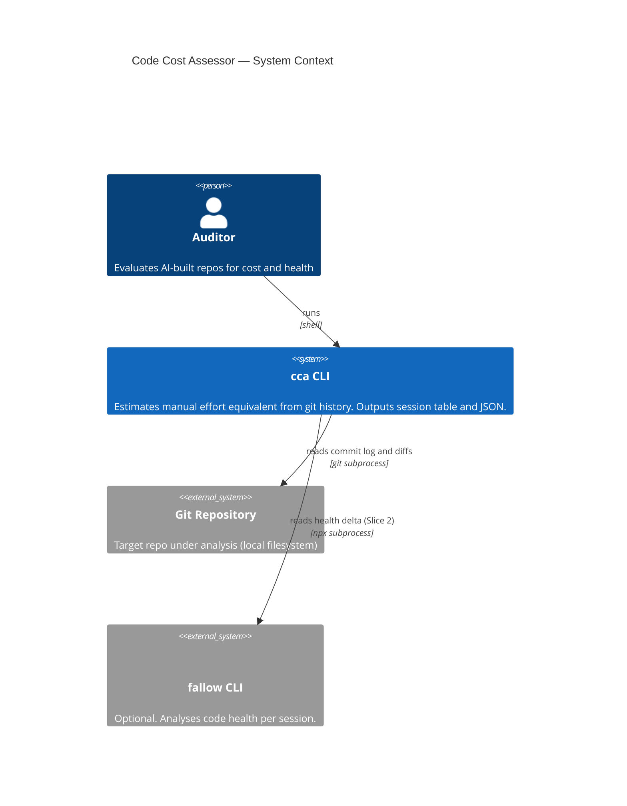
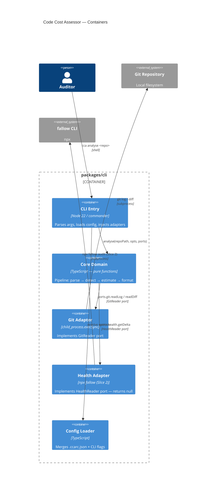

# Architecture Brief — code-cost-assessor

Last updated: 2026-05-20 | Wave: DESIGN

---

## Application Architecture

*Written by: nw-solution-architect (DESIGN wave)*

### Pattern

**Pure Core / Imperative Shell** via function-level architecture (hexagonal, no classes).

- Business logic lives in pure functions in `packages/cli/src/core/`. No I/O, no subprocess calls.
- All I/O and side effects are in `packages/cli/src/shell/`. Shell calls core; core never imports shell.
- Ports are TypeScript function type signatures (`GitReader`, `HealthReader`).
- Adapters are functions matching those type signatures, passed to the core orchestrator as parameters.
- Boundary enforced by dependency-cruiser in CI.

### Paradigm

**Functional** — pure functions, explicit data flow, pipeline composition. No classes. DI via parameter passing.

### C4 System Context



### C4 Container



### Port Contracts

```typescript
// packages/cli/src/core/ports.ts

type LogOpts = { noMerges: boolean; format?: string }

type GitReader = {
  readLog: (repoPath: string, opts: LogOpts) => string
  readDiff: (repoPath: string, sha: string) => string
}

type HealthReader = {
  getDelta: (repoPath: string, fromSha: string, toSha: string) => HealthDelta | null
}
```

### Component Directory Layout

```
packages/cli/
├── src/
│   ├── core/                    # pure functions — no I/O
│   │   ├── ports.ts             # GitReader, HealthReader types
│   │   ├── types.ts             # Commit, Session, FileStats, AnalysisResult
│   │   ├── parse-commits.ts
│   │   ├── detect-sessions.ts
│   │   ├── classify-file.ts
│   │   ├── estimate-cost.ts
│   │   ├── compute-hours.ts
│   │   ├── format.ts
│   │   └── analyse.ts           # pipeline orchestrator (accepts ports)
│   └── shell/                   # I/O and adapters
│       ├── git-adapter.ts       # implements GitReader
│       ├── health-adapter.ts    # implements HealthReader (null stub)
│       ├── config-loader.ts     # .ccarc.json + CLI flag merge
│       └── index.ts             # commander, injection, no domain logic
├── tests/
│   ├── unit/core/               # pure function tests — no mocks
│   └── acceptance/              # subprocess tests — real adapters
├── .dependency-cruiser.cjs      # enforces core ↛ shell
└── vitest.config.ts
```

### Technology Stack

| Concern | Choice | Version |
|---------|--------|---------|
| Runtime | Node.js | 22.18 |
| Language | TypeScript (type-stripped) | — |
| Module system | ESM | — |
| CLI framework | commander | ^12 |
| Git access | `child_process.execSync` | stdlib |
| Health analysis | `npx fallow` | ≥2.76 |
| Testing | Vitest | ^3 |
| Boundary enforcement | dependency-cruiser | ^16 |
| User config | `.ccarc.json` | — |

### Key Decisions

See ADRs:
- [ADR-01](adr-01-type-stripped-ts.md) — Type-stripped TypeScript over tsc compile step
- [ADR-02](adr-02-pure-core-shell.md) — Pure Core / Imperative Shell with explicit port contracts
- [ADR-03](adr-03-execsync-over-simple-git.md) — execSync over simple-git
- [ADR-04](adr-04-health-adapter-deferred.md) — fallow health adapter stubbed to null for Slice 1
- [ADR-05](adr-05-single-package.md) — Single package over @cca/core + @cca/cli monorepo split
